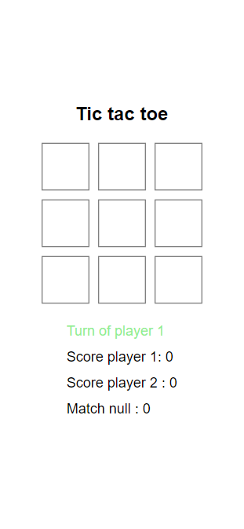

## How I write my TIC TAC TOE game with Functions

This is a simple Tic-Tac-Toe game implemented in JavaScript that can be played in the browser.

## Table of contents

- [Overview](#overview)
  - [Screenshot](#screenshot)
- [My process](#my-process)
  - [Built with](#built-with)
  - [What we can learn](#what-i-learned)
  - [Continued development](#continued-development)
  - [Useful resources](#useful-resources)
- [Author](#author)
- [Acknowledgments](#acknowledgments)

## Overview

This is a JavaScript implementation of the classic game Tic-Tac-Toe. The game is played on a 3x3 grid, and players take turns marking X or O in a cell. The first player to get three in a row wins the game. The code uses the Document Object Model (DOM) to dynamically render the game board and update the game state.

Overall, creating a game like Tic-Tac-Toe can be a great way to learn more about web development, and it's always satisfying to see a functioning game come to life through your code.

### Screenshot

## My process (code explain)

1 - The code uses an event listener to check if any of the boxes in the game are clicked, and then calls the boxChecker() function.

2 - The boxChecker() function checks if the clicked box has already been selected and returns false if it has. 
If the box hasn't been selected, the function then determines whether to display an "X" or an "O" on the box based on the current player's turn. The function then updates the boxesState object with the current player's number and calls the verifyVictory() and turnSwitcher() functions.

3 - The turnSwitcher() function switches the current player to the other player's turn and updates the currentPlayer variable to reflect the change.

4 - The verifyVictory() function checks if any of the players have won the game or if the game has ended in a tie. If a player has won the game, the victoryAlert() function is called and the winning player's score is updated. If the game has ended in a tie, the nullAlert() function is called and the number of tie games is updated. Otherwise, the function returns false.

5 - The victoryAlert() function displays a message to the player who won the game and then resets the game board by calling the gameReset() function.

6 - The nullAlert() function displays a message to the players that the game has ended in a tie and then resets the game board by calling the gameReset() function.

7 - The gameReset() function resets the boxesState object and clears the contents of all the boxes on the game board.

### Built with

- CSS
- JavaScript 

### What we can learn in this project

1 - Manipulating the DOM
2 - Working with Objects
3 - Working with Functions / Arrow Functions

The tic-tac-toe game project provides an excellent opportunity to learn and practice some fundamental web development concepts. In this project, you will learn how to manipulate the Document Object Model (DOM) to dynamically update the content on a web page. This skill is particularly important for creating interactive and dynamic web pages.

You will also learn how to work with objects in JavaScript. In the tic-tac-toe game project, you will use objects to store the game state and player information. This will allow you to access and update the game data throughout the code more easily. You will also use objects to represent the game board, which will help you to check for winning conditions more efficiently.

The project also involves working with functions and arrow functions. Functions are a core concept in JavaScript, and you will use them to handle various aspects of the game logic, such as checking for a winner or updating the game state. Arrow functions, on the other hand, provide a more concise and elegant way to write functions in JavaScript.

By completing this project, you will gain a deeper understanding of these fundamental web development concepts. You will also gain practical experience in using these concepts to create a functional and interactive tic-tac-toe game. This project is an excellent opportunity for anyone looking to improve their skills in web development.

### Continued development

I plan to continue this project by adding some features like button to restart score.
Add some design UI feature and edit more CSS part. 

### Useful resources

- This an amazing screenShot tool - [GoFULLPage Chrome extension](https://chrome.google.com/webstore/detail/gofullpage-full-page-scre/fdpohaocaechififmbbbbbknoalclacl/related) 

## Author

I am a JavaScript developer who is passionate about web development. I am actively seeking job opportunities to further my skills and gain real-world experience. 

If you are interested in hiring a motivated and dedicated junior developer, please don't hesitate to contact me through my LinkedIn account or email at ynsyldz44800@gmail.com. I look forward to hearing from you!

- [My Youtube chanel](https://www.youtube.com/channel/UCHcbGs0_a6xnTPpbkoRaGuw) (Maybe I'll produce some dev stuff on it)
- [My linkedin](https://www.linkedin.com/in/yunus-yildiz-b919b7206/) 

You can also send me questions about my code if something wrong. Thank

## Acknowledgments

Thank to chat GPT !
